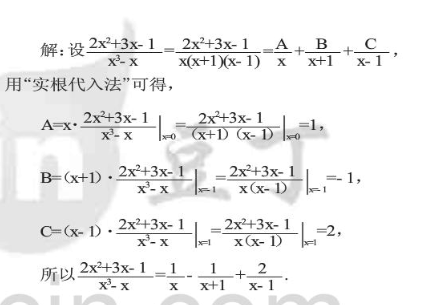
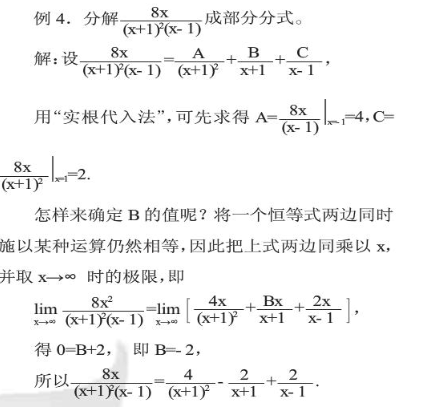

## **分子的次数 < 分母的次数 **（真分式）

**对于小分式，分子的次数** 总会 **比分母的次数少1次方**：**deg(分子) = deg(分母) - 1**

对于**高阶极点**来说，**小分式的个数** = **分母的因式个数**

### 实根代入法结合极限法

##### 实根代入法

##### 极限法

## 分子的次数 ≥ 分母的次数**（假分式）

### 多项式除法

