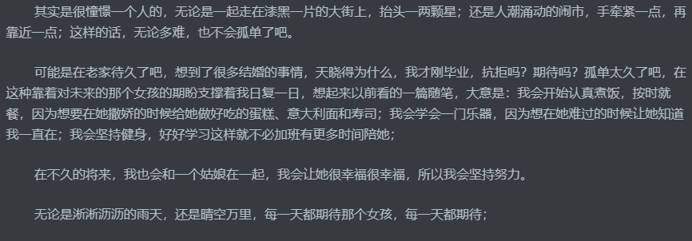

【链接】[有没有可能自己这一辈子都遇不到自己喜欢](https://www.zhihu.com/question/318144086/answer/645335939)

墙你好，我是15届毕业（校友？已经不能说是在校生了），家人催婚是一方面吧，但主要还是自己，原来一直想是自己要有所成就才可以承担的起两个人的未来，但很突然的，哲理老妈说了一句话让我很有感触，结婚又不是让你配对，你现在不谈以后不成了为结婚而结婚了吗？不想油腻搭讪，吵到别人也不好；不想相亲，很难有共同话题，遂有此贴；

客观条件：身高/体重：173/140（不是胖，健身）；颜值：中等；爱好：健身吉他；工作：软件开发；现居地：杭州；

主观评价：

优点：积极上进（会考虑将来，所以现在要加倍努力）；体贴，喜欢照顾自己爱的人（反正我姐和我小侄女照顾的蛮好）；家人至上主义（话说，不知道有没有人听过朱生豪的“我是，我是宋清如至上主义者”，太甜了）；

缺点：不擅长和喜欢的女生交流（和同事交接倒都说我逻辑清晰，但见到喜欢的女生就很紧张的那种）；无趣（虽然个人鄙见不这么想），原因：不抽烟喝酒泡吧不玩游戏，爱喝茶骑行吉他和阅读；

qq：1507757621（小号）

如若有看官看出我是谁，千万看破不说破，也别找我，好让我假装所有人都不知道是我

整理日记看到自己很久以前写的一句话：

