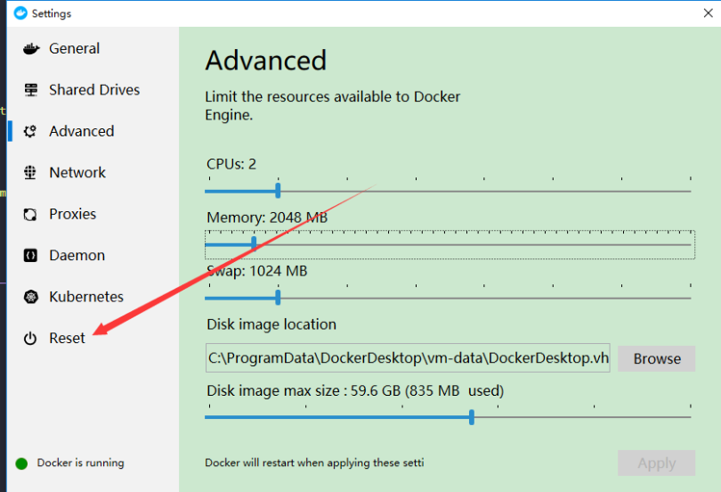
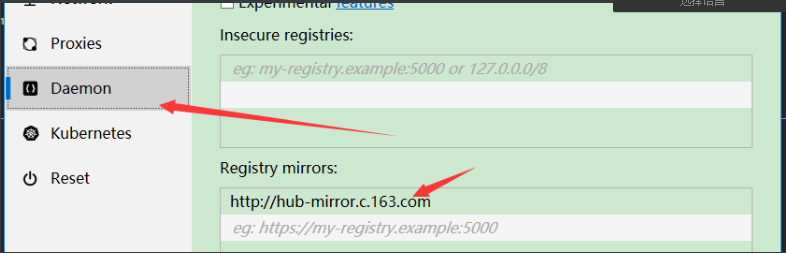
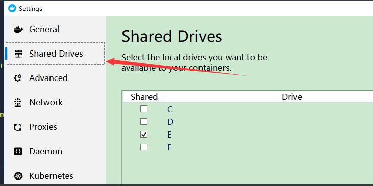

```javascript
error while removing network: network local-dev-env_default id e0b2625faadb121d9bf6b57bf9eb6b5c56eeccc3b053f9466c36ab44e5d1c97f has active endpoints
```


### 解决

##### 重置docker

- setting-》reset

  

- 成功后设置两步

  - 163镜像配置

    ```
    http://hub-mirror.c.163.com
    ```

    

  - shared 盘符

    

- 之后就是拉取镜像（修改local-dev-env.yml配置文件-登录公司docker账号）-》启动容器（docker-compose up -d）-》安装依赖（进入容器docker-compose exec XXX bash  - composer install）了

