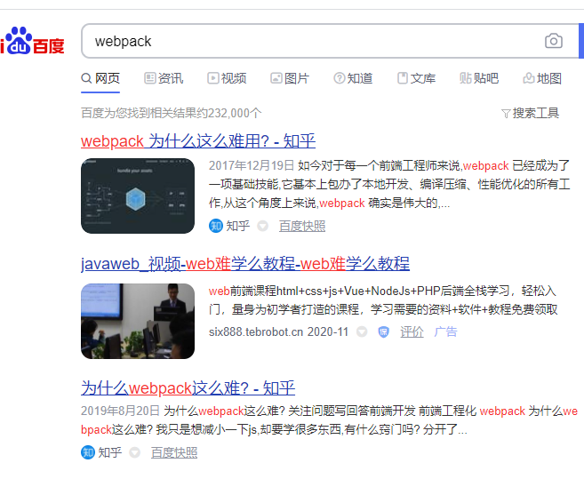
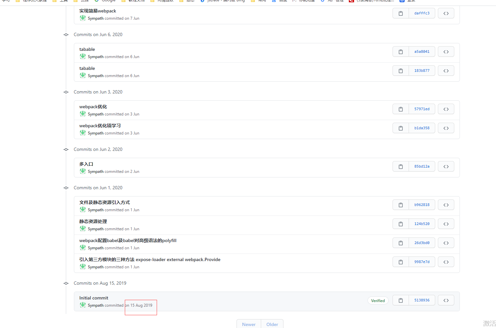
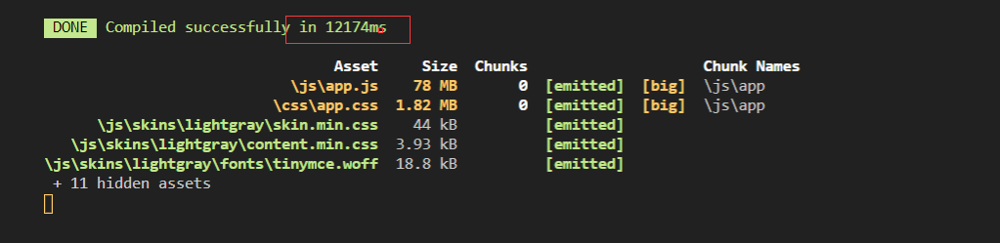

### 自我介绍

我开始在蓝铅笔项目组，年末雷哥带我进了画友星球，次年画友星球就活在了我们心中；然后我跟着小明来到了大触来了，所以我还是很珍惜在大触的日子的

### 学会复盘

- 子弹计划：及时记录
- 一周记录：语雀复盘

### 三件小事N+1

- 神策埋点全局方法封装

**中间插入**：数学家救火

###### 结束中心：任何一件小事，都要有所积累

### 任何一个成长都有意义

​	一年前，我开始阅读webpack，这是前端同学很怕的拦路虎，具体是怎么样的呢？当我们在百度搜索webpack，会是这样的结果；

于是作为刚从后端转前端不久的我，当时的表情应该是这样的

而且其实这和我当前的工作内容并不契合，因为它属于前端的基层构建，相当于我们大触的【】；

- 脚手架搭建（重点）

- 七牛云出错信息+双十二砸金蛋页面错误排查+监听a标签解决方案优化（次重）
- canvas绘制+ 落地页上传插件（带过）

###### 结束中心：步履不止

19岁的王志远读作文素材，靠记忆在作文上写沈从文闲学中国服饰而后写《中国古代服饰研究》的故事，几年后的王志远才真的明白，每个付出都有意义，任何打不败你的，都将使你更强大，步履不止；