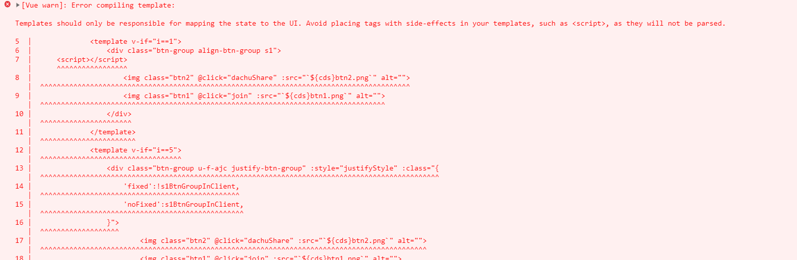

主要解决：在php的mvc框架中，我们如何封装组件

实际场景：我们在blade中如果用php的@include语法引入分享组件（举例），如果分享组件时用Vue写的；

1. 如果每个组件都new Vue实例，造成性能损耗，如何解决   == （Vue.mixin）
2. 组件通信：包括父子组件方法通信，数据传递；如何实现   == （Vue.mixin）
3. Vue在html中如果发现`script`标签，会在控制台抛出大面积警告，但有时候我们又确实得将组件放在Vue托管的html内，如何解决    (=== JSONP)

