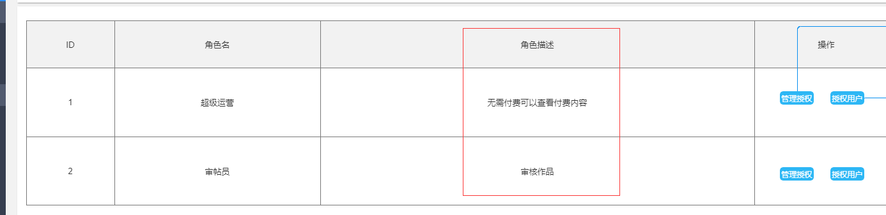
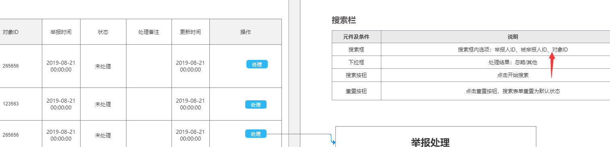
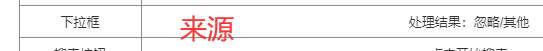
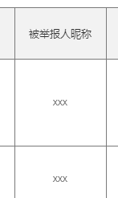
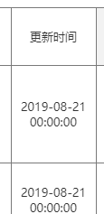
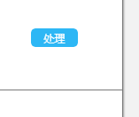
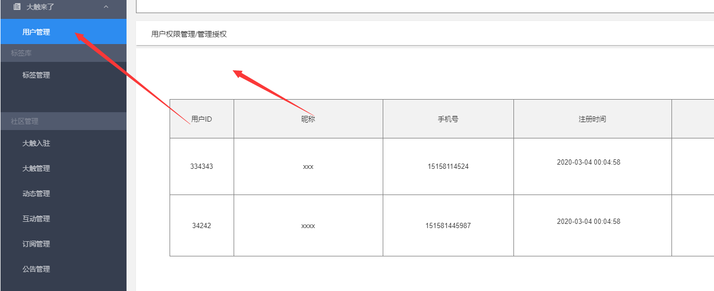

### 权限管理

##### 未确定字段



待加

##### 接口错误


待改

### 举报管理

##### 未确定字段



是资源id



是状态【】



reply信息



是的


##### 产品

已处理中需要显示处理按钮吗



**用户权限管理**

管理授权打开的是子页面吧？在sidebar中不出现



1


```
let arr = str.replace(/(\r)?\n/g,',').split(',,,').map(str=>({title: str,key: '',align: 'center'}))
undefined
JSON.stringify(arr)
```


## 第二阶段问题


举报详情无返回