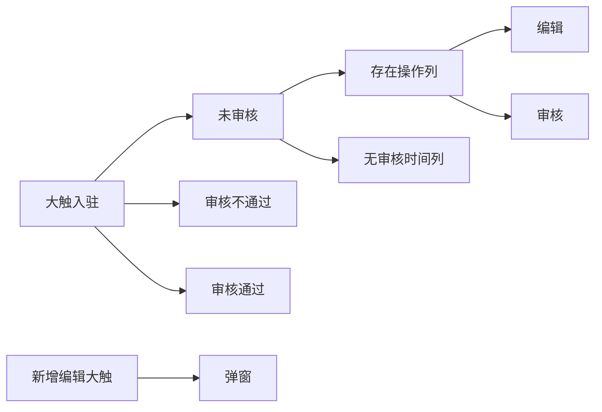
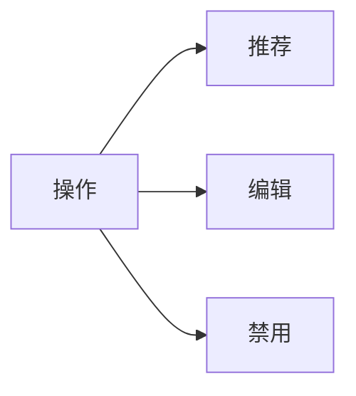
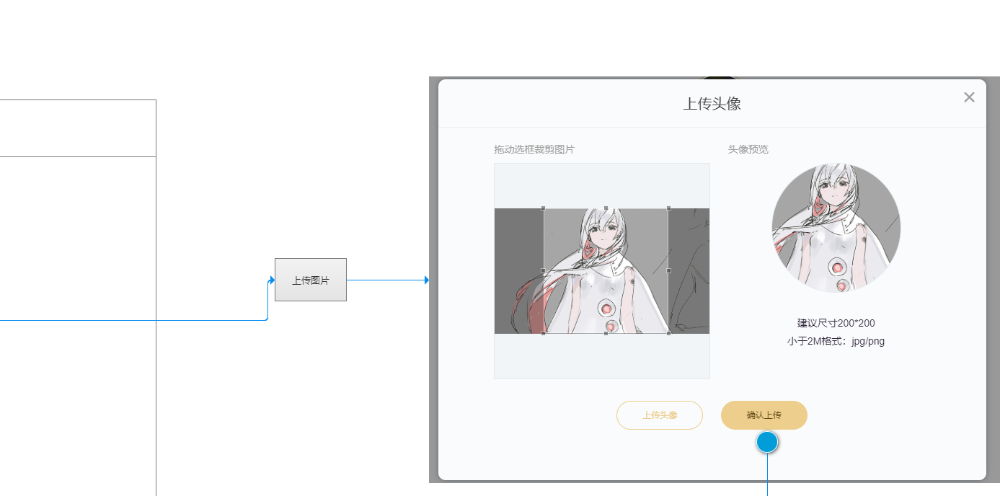

## 排期疑问

1. 包含接口时间吗？

```
过程中可能需要等接口
```


## 整体流程

1. QQ群管理：0.5

#### 社区管理

##### 大触入驻：1+1+1+1+1=5



- 审核后就不能再编辑大触信息了？ 是的

- 动态内容是指什么？需放置在哪 五关
- 来源是指什么？后台、APP

- 【用户昵称】下拉框的其他内容是什么？用户昵称、用户ID、手机号码、职业、联系QQ、QQ群号


##### 大触管理：1+0.5+1=2



- 禁用之后无法取消禁用吗？（还是说单选框非选中就是取消）

- 部分字段被框起来是为什么？

##### 支付管理：1


##### 动态管理：1+1+1=3


##### 订阅管理：1

##### 举报管理：1+1=2

- 未处理 已处理数 是指当前页的个数吗 ？ 不是，是接口返回的两个字段


##### 公告管理：1+1=2

- 编辑只改标题就好了？
- 删除、推送提示框自定义吗？还是不需要二次确定

##### 马甲管理：1+1+1=3




- 这个组件我们有吗

##### 互动管理：1+1=2


##### 用户权限管理：1


##### 推广为管理：1


##### 标签管理：1+1=2

- 哪个页面

##### 版权管理：1+1+1=3

##### 版权人认证：1+1+1=3