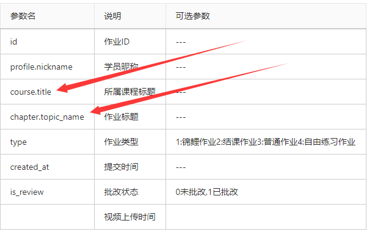
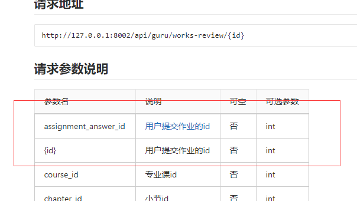
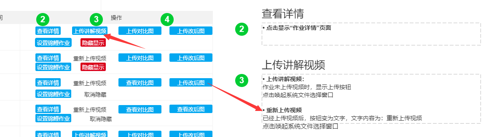

### 作品管理

###### 作业管理——筛选

- 视频上传时间是哪个字段？暂无

- 作品列表是哪个接口？课程作业列表

- 字段缺失？待定

  

###### 30号

- {id}字段要传吗？因为已经放在url上了

- 是不是需要一个【是否已上传视频】的标识（对比图改后图相同）

  

### 待完成

##### 作业管理——筛选

- 操作状态的初始化及更改与作品成一对一

- 【批量下载】功能实现

## 安排

1. 作业管理——筛选：布局数据渲染   30号前
2. 作品详情：4号前完成
3. 批量下载：7号前
4. 专业课：8号

|      | 下载条数 | 图片体积   | 下载耗时 |
| ---- | -------- | ---------- | -------- |
|      | 999      | 0.15 ~ 0.3 | 白屏     |
|      |          |            | 19       |
|      |          |            |          |

