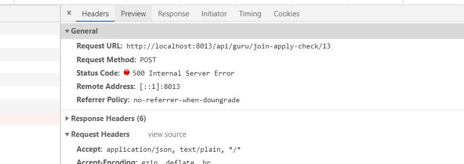

## API

### 大触入驻

- 审核通过 接口500（后端）

- 审核弹窗  == （ 确定取消） 按钮要不要去掉（产品）

#### 大触管理

###### 字段

###### 接口

禁用大触：待问（已和后端沟通，需问产品）

### 动态管理

- 版权认证  请求字段    			待后面添加（咨询后端，此处先不做）

## other

- 社区各个页面的sidebar权限（产品）

- 大触入驻-审核弹窗的样式（产品）  已ok
