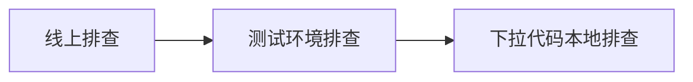
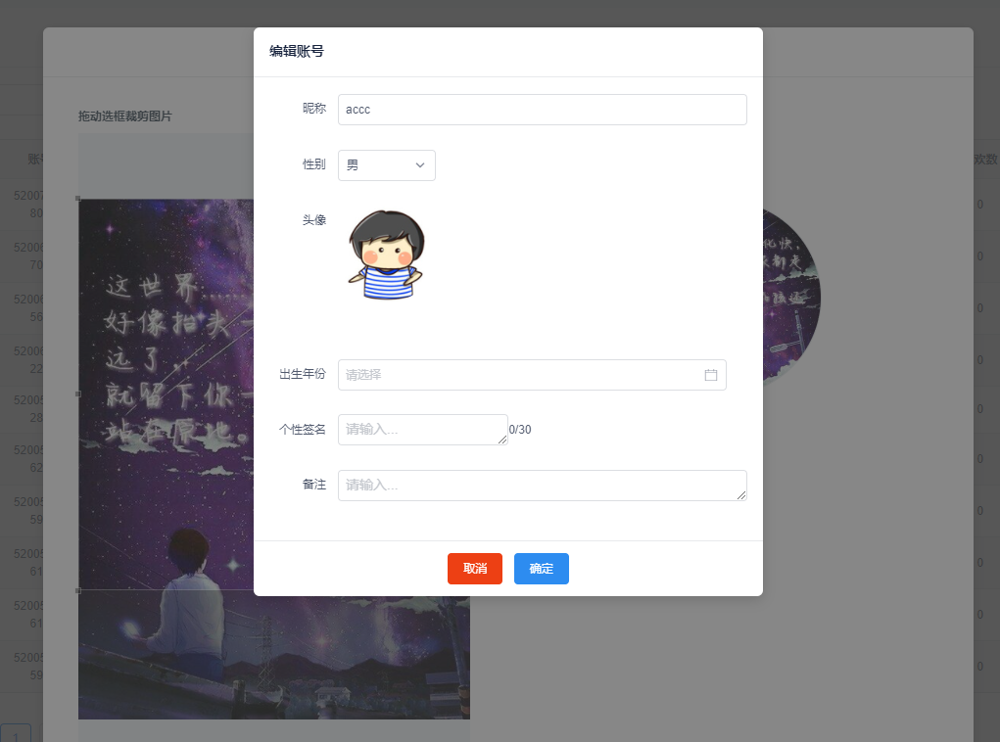
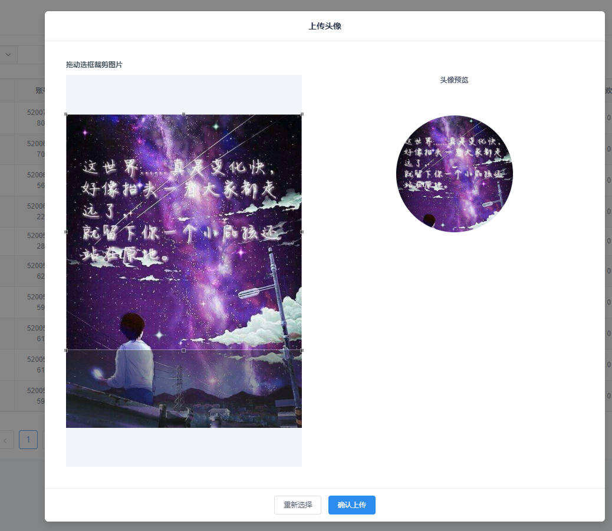

### 背景

公司后台项目是多个项目组共享一套的，某天，产品大大说出现弹框被遮挡问题，关键这是在线上，要知道我们的上线流程是：

```
本地自测-》测试同学检测-》预发布canary环境测试-》上线
```

所以在功能上线时必然不可能存在【遮挡】这种明显缺陷的，匪夷所思；

### 进行修复

线上bug，那必然是【紧急】优先级的，那就吭哧吭哧开始修，排查思路



神奇的事情发生了，测试环境和线上都是预期内的情况



本地确实正常的展示



费解。。。

### 进行分析

既然代码没问题，开始分析变量

- 环境（域名）
- 依赖

环境不会影响业务代码，那只能是依赖了，找到我们公司依赖的第三方UI框架`iview`的github仓库，终于发现曙光

[[Bug Report]Modal 对话框点击后z-index会增加](https://github.com/iview/iview/issues/4480)

这是他们仓库曾经修复过的问题，也就意味着这个问题的出现源于我们依赖的`iview`的版本，联想五天前（距离20-12-10号）蓝铅笔曾更新过iview的版本，发现线索，王尔摩斯上线，默默记下第三方修复此问题时的版本号（3.5.5）走，看版本号去；

果不其然，本地是3.5.4，这也就意味着很尴尬的错过了第三方的修复版，果然还是默默承担了所有。

既然找到原因，那就去撕逼吧，让他们升级版本就好啦，于是我“气势汹汹”的上楼也

### 开始解决问题【撕逼】

嗯。过程必然是很神武、威风凛凛的我，战胜了八楼以路哥为代表的邪恶势力，以他们真心诚意的羞愧认怂而告终。

额。虽然结果是放弃升级，而后心痒难耐的我蹭着下班经过无数踩坑后升级成功，虽然又是一个月明星稀、孤单单一人关公司灯的夜晚。

但是，请相信我是撕逼成功的好伐

言归正题：记录下laravel框架下升级iview4.xx的踩坑日记吧

### 升级ing

1. 更改版本控制中的iview，因为4版本中的iview更名为view-design，所以我们在package.json中的iview改为如下代码

   ```
    "view-design": "^4.0.0",
   ```

2. 在入口文件中将`iview`改为view-design`

   ```
   import iView from 'view-design';
   Vue.use(iView);
   ```

3. 更改css引入，我司是直接引入的less文件，如果是引css请自行改名即可

   ```
   @import "~view-design/src/styles/index.less";
   ```

4. laravel 框架中使用的是`laravel-mix`进行打包，其实就是webpack的高度封装，那自然会用到将第三方包拆分的功能，所以要在【拆分】目录上加上`view-design`

   ```
   mix.js('resources/assets/js/app.js', 'public/js')
       .extract([ 'view-design'])
   ```

   

