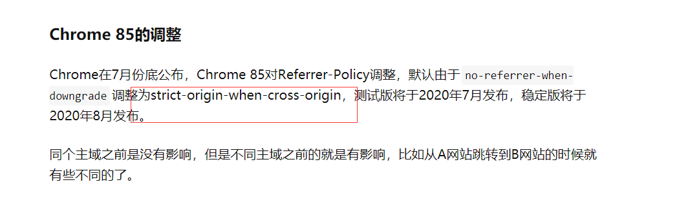
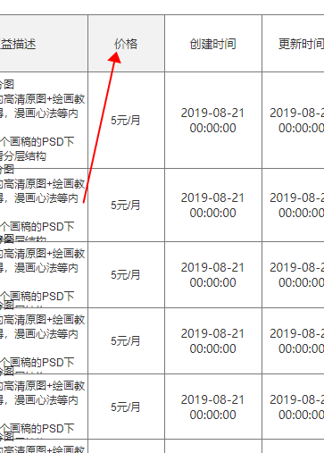

### referer + referer Policy 

##### referer Policy 

- **No Referrer When Downgrade**   多数浏览器默认使用  

```
仅当发生协议降级时不发送Referrer信息   (如 HTTPS 页面引入 HTTP 资源，从 HTTPS 页面跳到 HTTP 等）
```

- **strict-origin-when-cross-origin**   

```
对于同源的请求，会发送完整的URL作为引用地址；在同等安全级别的情况下，发送文件的源作为引用地址(HTTPS->HTTPS)；在降级的情况下不发送此首部 (HTTPS->HTTP)。
```




1. 根据筛选条件+审核状态搜索列表数据
2. 根据筛选条件 + 三个状态 搜索出三个count


### 订阅管理

是指origin_price还是sale_price


