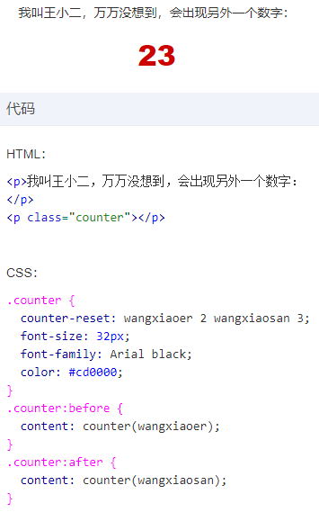

### 盒尺寸四大家族

#### content

##### 替换元素

- 特性
  - 内容外观在css作用域之外
  - 有自己的尺寸  一般是300 x 150
  - 对于css属性，有自己的一套表现规则
  - 不支持伪元素
- 尺寸计算规则（权重由小到大）
  - 固有尺寸  不加修饰的默认尺寸  （如果含有固有的宽高比例，而仅仅设置了宽或高，则会按比例渲染）
  - html尺寸  html原生属性改变的尺寸值
  - css尺寸  css定义渲染
  - 上述皆无则300 x 150；内联替换元素和块级替换元素均使用同一套上述渲染规则

- 替换元素和非替换元素的距离

  - src

  - content   （谷歌浏览器所有标签均支持此css属性，其他浏览器只在伪元素上支持）

    - content属性生成的对象叫作“匿名替换元素”

    - 特性

      - 生成的文本无法被选中或复制（类似user-select:none）；且无法被seo；
      - 生成的内容无法被获取（计数器什么的就别想了）

    - 用途

      - 生成图片  content: url(img);

      - attr属性内容生成  content: attr(data-title);

      - 计数器

        - counter-reset    为计数器起名 【设置起始值】 （可以取多个值）

          

      - content-increment   计数器递变   【计数器名字】【程度变量】（可以触发多个） 

      - counter   方法  counter(【计数器名字】)

      - [counters   方法   counters(name,string)](https://demo.cssworld.cn/4/1-18.php)

        - name
        - string  连接符

