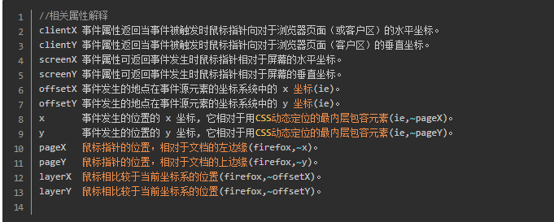

## 基础规则

#### 变量命名规则如下：
1、变量命名必须以字母、下划线”_”或者”$”为开头。其他字符可以是字母、_、美元符号或数字。
2、变量名中不允许使用空格和其他标点符号，首个字不能为数字。
3、变量名长度不能超过255个字符。
4、变量名区分大小写。(javascript是区分大小写的语言)
5、变量名必须放在同一行中
6、不能使用脚本语言中保留的关键字、保留字、true、false 和 null 作为标识符。
截止到目前为止JS描述了一组具有特定用途的关键字，一般用于控制语句的开始或结束,或者用于执行特定的操作等。关键字也是语言保留的，不能用作标识符。if for switch  case  break  continue  while  var  function


## API

#### document

-  activeElement     返回文档中当前获得焦点的元素。


#### Array

- 会改变原数组的方法 7种（以下是vue2.0的扩展对象，还有两个不常用的api：arr.fill()   arr.copyWithin()）
  - shift
  - unshift
  - pop
  - push
  - sort
  - reverse
  - splice


### 坐标问题

#### 鼠标坐标相关



##### 怎样获取鼠标相对于浏览器可视文档区域左上角的位置？

```
x, y和clientX, clientY皆可，但是x, y在IE下表示鼠标相对于文档开头的位置（即如果有滚到条的话，会计算在内），还有FF也不支持x, y
```

```js
let pos = {x: "",y: ""}
pos.x = e.clientX;
pos.y = e.clientY;
```

##### 怎样获取鼠标相对于文档开头的位置？（即pageX，pageY）

```js
IE：使用相对于浏览器可视文档区域左上角+浏览器滚动条滚动距离 
非IE：使用pageX, pageY
layerX, layerY其实也可以，但是IE和Opera不支持
```

```js
let pos = {x: "",y: ""}
// ie9下不兼容
if ( event.pageX == null) {
    pos.x =  e.clientX + document.documentElement.scrollLeft;
    pos.y = e.clientY + document.documentElement.scrollTop
 }else {
    pos.x = e.pageX;
    pos.y = e.pageY;
}
```

##### 怎样获取鼠标相对于事件源(event.target||event.srcElement)左上角的位置？

```
先获取鼠标相对于浏览器可视文档区域左上角的位置
然后获取事件源相对于浏览器可视文档区域左上角的位置
相减
```

```js
let pos = {x: "",y: ""}
var box = (e.target || e.srcElement).getBoundingClientRect(), 
pos.x = e.clientX - box.left, 
pos.y = e.clientY - box.top; 
```


##### tips

拖动目标的时候，经常有文字被选中

```js
function stopSeleted(){
    try{  
      if(document.selection){//IE ,Opera  
          if(document.selection.empty)  
                   document.selection.empty();//IE  
          else{//Opera  
                   document.selection = null;  
          }  
      }else if(window.getSelection){//FF,Safari  
           window.getSelection().removeAllRanges();  
      }  
	}catch(e){}
}
```

**[一个可以自由拖动的代码](https://www.cnblogs.com/youxin/p/3380796.html)**


## js引擎

### 宏任务和微任务

##### 宏任务

|                       | 浏览器 | Node |
| --------------------- | ------ | ---- |
| setTimeout            | 1      | 1    |
| setInterval           | 1      | 1    |
| setImmediate          | 0      | 1    |
| requestAnimationFrame | 1      | 0    |

##### 微任务

|                            | 浏览器 | Node |
| -------------------------- | ------ | ---- |
| process.nextTick           | 0      | 1    |
| MutationObserver           | 1      | 0    |
| Promise.then catch finally | 1      | 1    |

## 语法


### 事件

- 标签上的onclick事件和addEventListener绑定的事件不会冲突，且onclick可以绑定多个函数，以;分割，执行优先级高。


