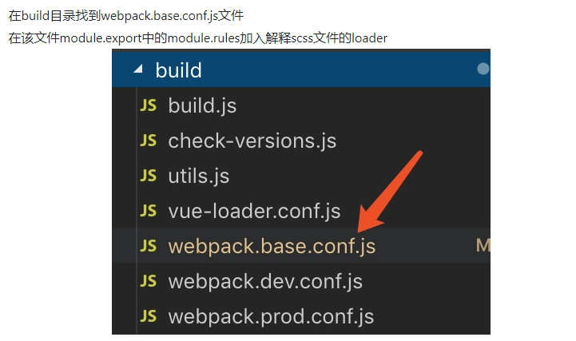

### 引入sass

```
npm install sass  --save-dev
npm install node-sass --save-dev
npm install sass-loader --save-dev
```

```
{
   test: /\.scss$/,
   loader: 'sass-loader!style-loader!css-loader'
}
```



注意 Module build failed: TypeError: this.getResolve is not a function at Object.loader 安装node-sass运行报错

卸载当前版本   npm uninstall sass-loader
安装     npm install sass-loader@7.3.1 --save-dev

