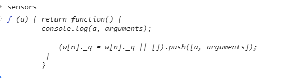
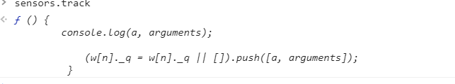
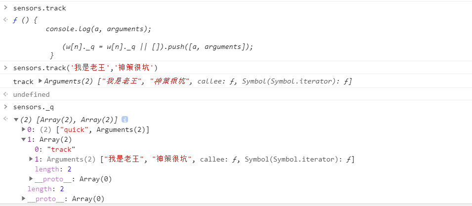
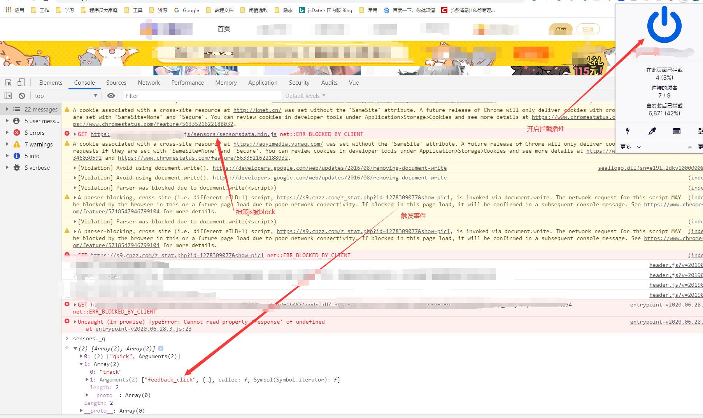

### 前言

最近公司的数据采集由谷歌分析转为神策埋点，提前一天完成后，本着“知其然也知其所以然”的精神，开始研究神策埋点的实现，正巧，出现采集不到的情况，研究发现是因为浏览器装了拦截插件（uBlock origin），sensorsdata.min.js被拦截了，自然无法采集，问题得解；这么简单吗？请看下文。（关键词：订阅发布）

### 问题

关键是，js都无法引入，为什么采集方法触发时不报错呢？关键点：

- js都无法引入，为什么采集方法触发时不报错
- 全局上依然有sensors属性，且依然可以触发track方法，但神策数据后台无数据

### 接入神策操作

其实接入过程挺简单的，分全埋点和代码埋点两部分，全埋点不需要开发人员关心，代码埋点只要在特定位置触发封装的方法，传入数据即可；那关键自然就是页面加载时初始化神策的逻辑。（文末附上全部初始化代码，其实大部分是神策文档提供的）；分步分析：（建议将全部代码复制出来对照着看）

一上来就是关键的自执行函数，传入神策使用者的配置参数，进入函数内容分析

1. 初始化sensors对象

   此处重点注意_q ,其实就是 订阅发布 中存储的队列，用于存储事件的数据

```js
// n = 'sensors'  w = window
w[n] = w[n] || function(a) { return function() {
            (w[n]._q = w[n]._q || []).push([a, arguments]);
         } 
        };
// 此时window上存在属性sensors 是一个高阶函数       
function(a) { return function() {
            (window['sensors']._q = window['sensors']._q || []).push([a, arguments]);
} 
// 此函数执行时会在sensors上挂_q属性 数组  且会将调用参数和默认数组传进去
```



2. 初始化属性 

   相当于挂载方法，触发方法时就是将采集事件和数据存入_q中（队列），即为订阅

```js
var ifs = ['track', 'quick', 'register', 'registerPage', 'registerOnce', 'clearAllRegister', 'trackSignup', 'trackAbtest', 'setProfile', 'setOnceProfile', 'appendProfile', 'incrementProfile', 'deleteProfile', 'unsetProfile', 'identify', 'login', 'logout', 'trackLink', 'clearAllRegister'];
// 遍历挂载 
    for (var i = 0; i < ifs.length; i++) {
        w[n][ifs[i]] = w[n].call(null, ifs[i]);
    }
```

以track为例

```js
w[n][ifs[i]] = w[n].call(null, ifs[i]);
// 相当于
sensors['track'] = sensors.call(null,'sensors') = function() {
            (window['sensors']._q = window['sensors']._q || []).push(['sensors', arguments]);
} 
// 此时如果触发方法，sensors上将有一个属性名为_q 的数组 用于存储采集事件 格式为 [method,[event,data]]
```



触发的话 就会存入_q



3. 引入sensorsdata.min.js  并插入文件（顺带将用户定义参数保存在sensors对象的para属性上）

```js
 x = d.createElement(s), y = d.getElementsByTagName(s)[0];
        x.async = 1;
        x.src = p;
        w[n].para = para;
        y.parentNode.insertBefore(x, y);
```


到此为止，我们已经了解了（实现了）代码埋点触发时将事件和需要的数据的采集，存入到_q中；个人理解其实这就是神策埋点的数据采集逻辑，采集好了再将这些传入神策的分析后台生成可视化表格就成了；

而且我们也能够解释我们最开始的疑问了

### 解答

- js都无法引入，为什么采集方法触发时不报错

  ```
  因为本来就是调用我们封装的对象，函数也有，自然不会报错
  ```

- 全局上依然有sensors属性，且依然可以触发track方法，但神策数据后台无数据

  ```
  sensorsdata.min.js被block了（拦截），神策没办法“发布”，自然没办法采集数据，所有数据还保留在sensors._q中
  ```

##### 验证

1. 开启uBlock情况，触发feedback_click事件，数据将存入_q中且不会被消费，后台无法采集数据

   

2. 关闭uBlock情况，触发feedback_click事件，数据将存入_q中随即被消费，_q中找不到数据，后台采集到数据

### 到此为止？不

延展：本地的sensor和神策的sensorsdata.min.js是怎么联系起来的呢？换句话说，神策是如何获得sensor._q的？（获取到了自然执行导入等操作不是问题）

下载被拦截的神策js文件放在本地开始研究，（涉及到公司名称，直接公开又担心涉及神策隐私，就没法提供地址了，很抱歉，会提供我研究的部分代码）

1. 首先，在个人项目中，会有一个挂载’sensorsDataAnalytic201505‘属性在window上的操作，属性值是定义对象名（我这是sensors）

   ```js
   // n = 'sensors'  w = window
   w['sensorsDataAnalytic201505'] = n;
   ```

2. 神策js中，会进行取值操作，获取到使用者定义的字符串，然后进行初始化操作（其实就是将本地的sensor对象的数据取出来，发布，然后将自己定义的对象替换上去）

   1. 判断，若存在调用sd.setPreConfig

   ```js
   "string" != typeof window.sensorsDataAnalytic201505) return "undefined" == typeof window.sensorsDataAnalytic201505 ? (window.sensorsDataAnalytic201505 = sd, sd) : window.sensorsDataAnalytic201505;
           sd.setPreConfig(window[sensorsDataAnalytic201505]),
   ```

   2. setPreConfig方法很简单，取出用户传递配置参数及事件队列

   ```js
   sd.setPreConfig = function(e) {
               sd.para = e.para,
               sd._q = e._q
           },
   ```

   3. 替换对象

   ```
     window[sensorsDataAnalytic201505] = sd,
     sd.init(),
     window.sensorsDataAnalytic201505 = 其他sd
   ```

### 全部初始化代码

```js
var currentHost = window.location.host;
var sensor_server_url = '测试环境数据采集后台地址';
// 环境判断
if (currentHost == "生产环境域名") {
    sensor_server_url = '生产环境数据采集后台地址';
};
(function(para) {
    var p = para.sdk_url,
        n = para.name,
        w = window,
        d = document,
        s = 'script',
        x = null,
        y = null;
    w['sensorsDataAnalytic201505'] = n;
    w[n] = w[n] || function(a) { return function() {
            (w[n]._q = w[n]._q || []).push([a, arguments]); } };
    var ifs = ['track', 'quick', 'register', 'registerPage', 'registerOnce', 'clearAllRegister', 'trackSignup', 'trackAbtest', 'setProfile', 'setOnceProfile', 'appendProfile', 'incrementProfile', 'deleteProfile', 'unsetProfile', 'identify', 'login', 'logout', 'trackLink', 'clearAllRegister'];
    for (var i = 0; i < ifs.length; i++) {
        w[n][ifs[i]] = w[n].call(null, ifs[i]);
    }
    if (!w[n]._t) {
        x = d.createElement(s), y = d.getElementsByTagName(s)[0];
        x.async = 1;
        x.src = p;
        w[n].para = para;
        y.parentNode.insertBefore(x, y);
    }
})({
    sdk_url: 'https://assets-cdn.lanqb.com/js/sensors/sensorsdata.min.js',
    name: 'sensors',
    server_url: sensor_server_url,
    heatmap: {
        clickmap: 'default',
        scroll_notice_map: 'default',
        collect_element: function(element_target) {
            // 如果这个元素有属性sensors-disable=true时候，不采集
            return element_target.getAttribute('sensors-disable') === 'true' ? false : true
        }
    },
    send_type: 'ajax',
    show_log: true,
});
var anonymous_id = null;
sensors.quick('isReady', function() {
    var user_type = null,
        roleArr = [];
    anonymous_id = sensors.quick('getAnonymousID');
    if (window.auth_user && window.auth_user.id) {
        sensors.login(window.auth_user.id);
        // 获取用户身份
        var roles = window.auth_user.roles;
        if (typeof roles != "object") return;
        for (var k in roles) {
            user_type = '注册用户'
        }
    }
    sensors.registerPage({ //设置公共属性
        platform_type: window.form_type,
        user_type: function() {
            return user_type ? user_type : '访客';
        },
    })

    sensors.quick('autoTrack'); //页面浏览事件($pageview)
});


function ssCustomTrack(ele_t, ele_type, class_name, content) {
    sensors.quick('trackHeatMap', ele_t, { //非a,input,button元素的点击采集
        '$element_type': ele_type,
        '$element_class_name': class_name,
        '$element_content': content
    });
}

function sensorTrack(event_name, prop_obj) {
    sensors.track(event_name, prop_obj)
}

```
