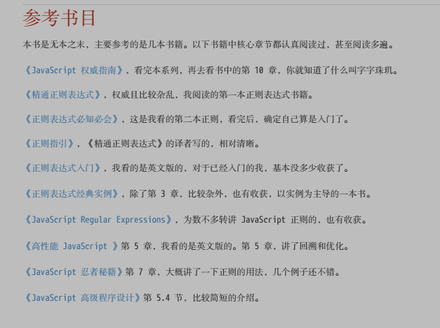

### 正则匹配位置
- 锚（位置）
  - es 5 中共有6个
    - ^ 脱字符  行开头位置
    - $  行结尾位置
    - \b  单词边界，具体为 \w与\W之间的位置 
    
    
    
    - \B  非\b所指的位置之外的所有位置
    
    - (?=p) p前面的位置
    
      
    
    - (?!p) ?=p的反面意思
    
      
### 正则分组

- 分组分支

- 分组引用 ： 正则引擎是这么做的，在匹配过程中，给每一个分组都开辟一个空间，用来存储每一个分组匹配到的数据。
  - 提取数据
    - string.match(regex) （regex.exec(string)等同）
    ```
    返回的一个数组，第一个元素是整体匹配结果，然后是各个分组（括号里）匹配的 内容，然后是匹配下标，最后是输入的文本。另外，正则表达式是否有修饰符 g，match 返回的数组格式是不一样的。
    ```
    - 构造函数的全局属性 $1 至 $9
  - 替换
  
- 返向引用 : 除了使用相应 API 来引用分组，也可以在正则本身里引用分组。但只能引用之前出现的分组，即反向引用。
  - \n n代表第几个分组
  - 括号嵌套以左开括号为准
  - 引用不存在的分组会匹配转义数（\2 则匹配 2）
  - 分组后面有量词则会以最后一次匹配结构为该分组内容

### 回溯

- 贪婪量词“试”的策略是：买衣服砍价。价钱太高了，便宜点，不行，再便宜点。 
- 惰性量词“试”的策略是：卖东西加价。给少了，再多给点行不，还有点少啊，再给点。
-  分支结构“试”的策略是：货比三家。这家不行，换一家吧，还不行，再换。

### 正则的拆分

###### 结构与操作符


重点： | （管道运算符）优先级最低，放在最后处理

### 六 正则的构建

##### 优化

- 使用具体型字符组代替通配符 消除回溯
- 使用非捕获型分组（?:）
- 独立出确定字符
- 提取分支的公共部分
- 减少分支数量

### 七 正则的使用

##### API

共有六个，字符串实例4个（search、split、match、replace），正则实例2个（test、exec）

###### 注意

- 要注意 search和match在使用时是会被转换成正则的，所以如果遇到正则里的特殊字（.）等，需要转义

- macth在使用时，如果正则没有g修饰，返回的是标准匹配结果的数组（整体匹配内容+分组捕获内容+整体匹配的第一个下标+输入的目标字符串）；有g修饰，返回的是所有匹配内容的数组

- 字符串的四个方法都是lastIndex为0开始的，即lastIndex始终不变；正则的两个方法，当正则是全局匹配时，每次匹配完成都会修改lastIndex

  

- split注意两点：1. 可以传第二个参数，为结果数组的最大长度；2. 当用正则截取时，分隔符也会在结果数组中

