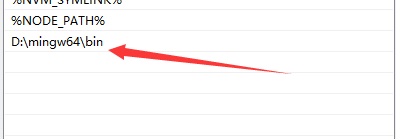
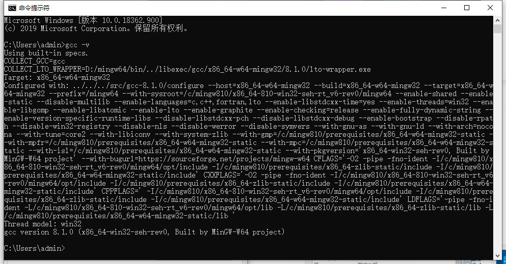
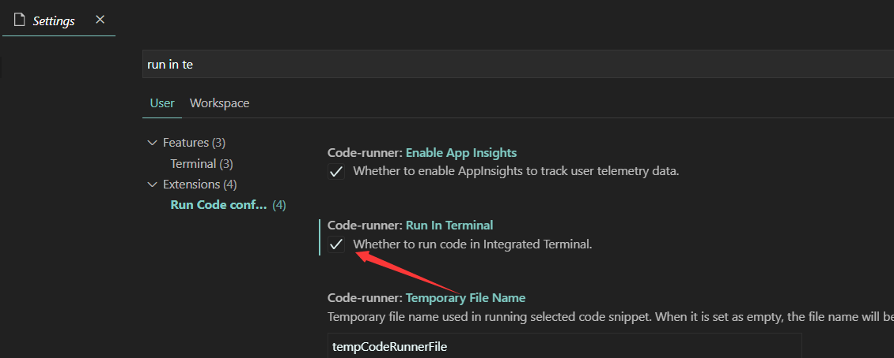
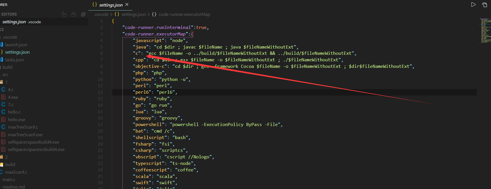

### 基础步骤

##### c编译环境

- 下载安装编译环境[mingw-w64](https://link.zhihu.com/?target=http%3A//www.mingw-w64.org/doku.php/download)

- 配置环境变量



- 测试是否成功：开启终端，输入gcc -v



##### vscode相关

- 安装插件code runner 和  c/c++


### 踩坑阶段

##### scanf无法在终端输入的情况

一个c程序不能交互等于死一半，但vscode默认处于只读模式，解决方法很简单，在setting中勾选上run in terminal



##### 自定义文件输出位置

code runner默认编译到当前文件目录，我们可以vscode工作新建.vscode文件，在其下新建setting.json；可以理解为局部配置文件，只在当前工作区有效；在其中配置一个code runner对于不同文件的处理命令



```json
 "code-runner.executorMap":{
"javascript": "node",
"java": "cd $dir ; javac $fileName ; java $fileNameWithoutExt",
"c": "cd $dir ; gcc $fileName -o $fileNameWithoutExt ; $dir$fileNameWithoutExt",
"cpp": "cd $dir ; g++ $fileName -o $fileNameWithoutExt ; ./$fileNameWithoutExt",
"objective-c": "cd $dir ; gcc -framework Cocoa $fileName -o $fileNameWithoutExt ; $dir$fileNameWithoutExt",
"php": "php",
"python": "python -u",
"perl": "perl",
"perl6": "perl6",
"ruby": "ruby",
"go": "go run",
"lua": "lua",
"groovy": "groovy",
"powershell": "powershell -ExecutionPolicy ByPass -File",
"bat": "cmd /c",
"shellscript": "bash",
"fsharp": "fsi",
"csharp": "scriptcs",
"vbscript": "cscript //Nologo",
"typescript": "ts-node",
"coffeescript": "coffee",
"scala": "scala",
"swift": "swift",
"julia": "julia",
"crystal": "crystal",
"ocaml": "ocaml",
"r": "Rscript",
"applescript": "osascript",
"clojure": "lein exec",
"haxe": "haxe --cwd $dirWithoutTrailingSlash --run $fileNameWithoutExt",
"rust": "cd $dir ; rustc $fileName ; $dir$fileNameWithoutExt",
"racket": "racket",
"ahk": "autohotkey",
"autoit": "autoit3",
"dart": "dart",
"pascal": "cd $dir ; fpc $fileName ; $dir$fileNameWithoutExt",
"d": "cd $dir ; dmd $fileName ; $dir$fileNameWithoutExt",
"haskell": "runhaskell",
"nim": "nim compile --verbosity:0 --hints:off --run",
"lisp": "sbcl --script",
"kit": "kitc --run"
},
```

此处不知道是不是我的问题，一直显示文件不存在，观察过后发现，$dir变量后面会多个"号，导致找不到文件，折腾很久没能解决，遂hack，我将c的编译命令改为了如下，相当于写死了，很不佳，但没时间折腾了，达到了我预期目标：1. 可输入输出；2. 编译的exe文件都放在src下的build文件下，并运行时自动找到并执行

```json
        "c": "gcc $fileName -o ../build/$fileNameWithoutExt && ../build/$fileNameWithoutExt",
```

