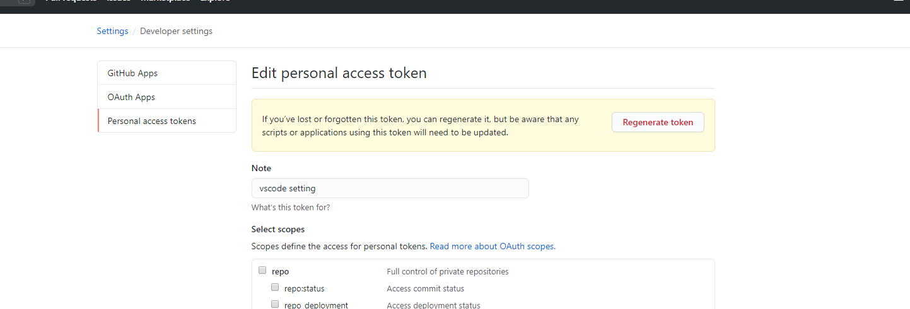

### 同步时出错，主要考虑是不是token失效了

##### 思考

setting sync同步主要两点

- token：用于和GitHub间的认证
- girst： 相当于索引凭证，用于指向某条配置信息记录

现在我们已经不需要自己配置token了，所以往往这个地方出问题，就完全一头雾水了，话不多说，当你出错时，按如下步骤试试

1. ctrl + shift + p 打开输入命令区，输入（清空信息）

   ```
   reset extension settings
   ```

2. 替换token

   1.在github上，setting->最下面developsetting->regenerate token

   

   2. 将新的token复制到vscode的xxx.json文件上

3. 重新更新，我的成功了