## font-family

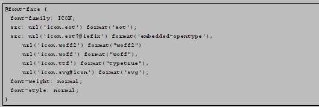


### 问题

- 为 什 么 这 里 需 要 有 两 个 src 呢？

  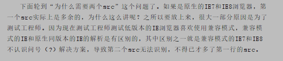

- \# iefix 是 干 什 么 用 的 呢？ 

  

  

- format() 功 能 符 有 什 么 作 用， 可 不 可 以 省 略？ 

  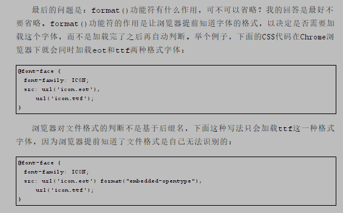

- 这 么 多 字 体 格 式 都 是 需 要 的 吗？

  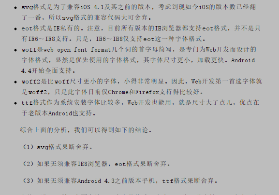

-  font-weight: normal 和 font-style:normal 是 不 是 多 余 的？

  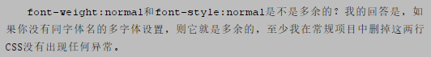

### 综上优化结果

```
@font-face { 　 
            font-family: ICON; 
            src: url(' icon.eot'); 
            src: local('☺'), 　
            url(' icon.woff2') format("woff2"), 　
            url(' icon.woff') format("woff"),
            url('icon.ttf')
        }
```

## text-indent

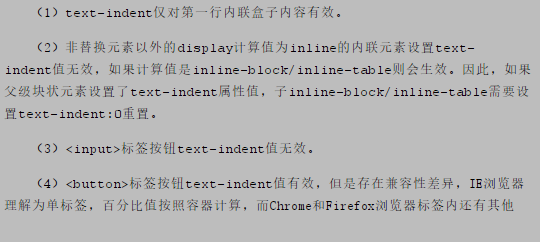

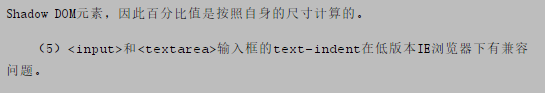

## letter-spacing

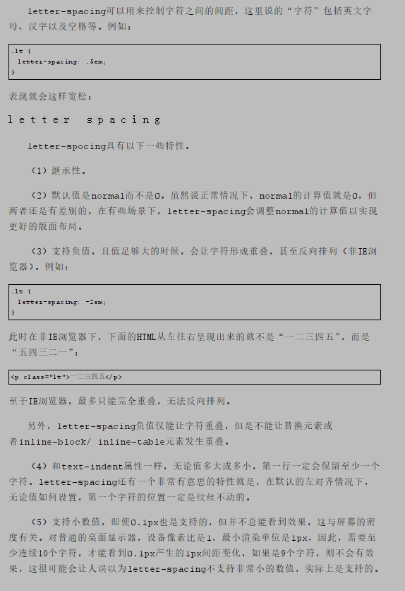

## word-spacing

控制空白字符的间隙宽度  注意，如果没有空白字符则无效

### 了 解 word-break 和 word-wrap 的 区 别

- work-break

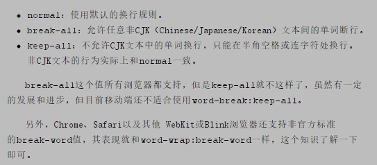

- work-wrap

  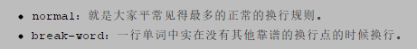

- [区别](https://demo.cssworld.cn/8/6-5.php)

  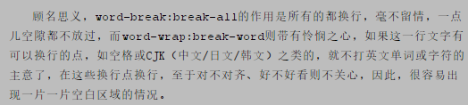

### white-space

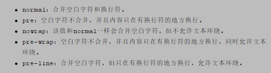

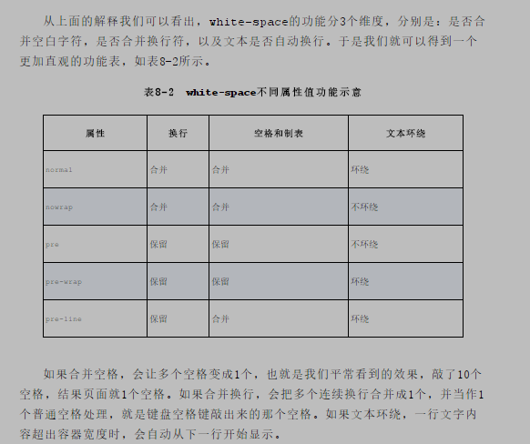