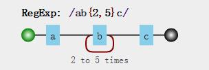
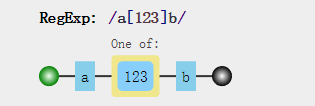
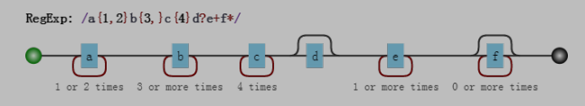
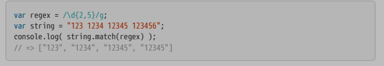
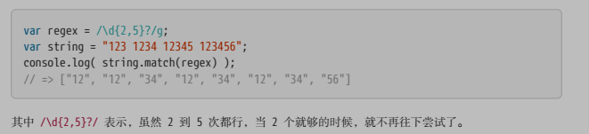
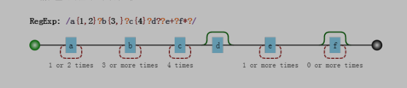
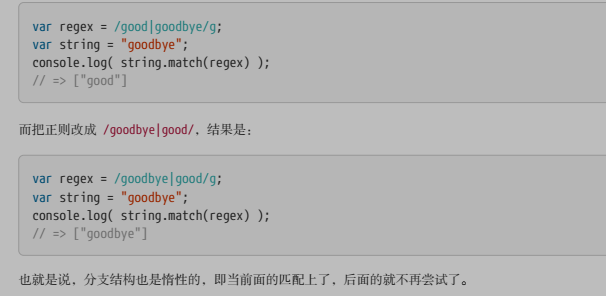
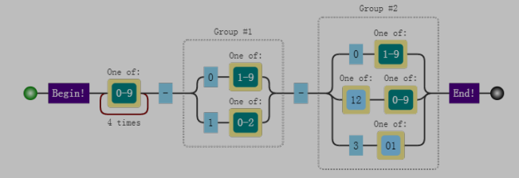
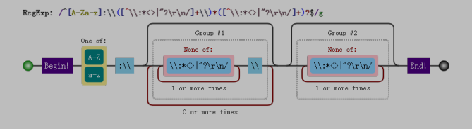

### 两种模糊匹配

###### 横向模糊匹配 

-  定义：字符组固定而出现次数不定 

  `/ab{2,5}c/g`

  

###### 纵向模糊匹配 ：

- 定义：出现次数不定而字符组固定

  `/a[123]b/`



### 字符组

- 定义：一组字符中的其中一个  `[abc]   one of 'abc'`

##### 范围表示法

 [123456abcdefGHIJKLM]，可以写成 [1-6a-fG-M]。用连字符 - 来省略和简写。

##### 排除字符组

- 定义：某个字符不是一组字符中的任何一个  `[^abc]`  匹配非abc的任何一个字符

##### 常见简写字符组

| 字符组                            | 含义                                                         |
| --------------------------------- | ------------------------------------------------------------ |
| \d                                | [0-9]     （digit数字）                                      |
| \D                                | [^0-9]                                                       |
| \w                                | [0-9a-zA-Z_]    数字字符下划线                               |
| \W                                | [^0-9a-zA-Z_]   非单词字符                                   |
| \s                                | [ \t\v\n\r\f]  表示空白符  （空格、水平制表符、垂直制表符、换行符、回车符、换页符） |
| .                                 | [^\n\r\u2020\u2029]   通配符 除换行符、回车符、行分隔符、段分隔符外任意字符 |
| [\d\D] \| [\s\S] \| [\w\W] \| [^] | 任意字符                                                     |

### 量词

- 定义：单元重复次数  {m,n}  

##### 简写

| 量词 | 含义             |
| ---- | ---------------- |
| {m,} | 至少出现m次      |
| {m}  | 出现m次          |
| ?    | 0/1次            |
| +    | {1,}至少出现一次 |
| *    | {0,}  任意次数   |
|      |                  |



##### 贪婪匹配和惰性匹配

- 定义：贪婪匹配是默认的，指的是匹配命中的情况下尽可能多的获取元素；惰性匹配命中情况下是指尽可能少的获取元素。

- eg

  - 贪婪模式

    

  - 懒惰模式



- 实现懒惰模式：通过在量词后面加个问号就能实现惰性匹配，因此所有惰性匹配情形如下：

  | 惰性量词 | 贪婪量词 |
  | -------- | -------- |
  | {m,n}?   | {m,n}    |
  | {m,}?    | {m,}     |
  | ??       | ?        |
  | *?       | *        |
  | +?       | +        |
  |          |          |



##### 多选分支

- 定义 ： 或，(p1|p2|p3)

- 特点：惰性，前匹配上了就停止

  

### 实战

1. 匹配16进制颜色

```js
 //  #ffbbad #Fc01DF #FFF #ffE
 /^#[0-9a-fA-F]{3}|[0-9a-fA-F]{6}/
```

2. 匹配时间

```js
// 23:59   02:07
/^[01][0-9]|[2][0-3]:[0-5][0-9]$/
```

3. 匹配日期

```js
// 2017-06-10
/[0-9]{4}-(0[1-9]|1[0-2])-(0[1-9]|[12][0-9]|3[01])$/
```



4. window操作系统文件路径

   ```js
   /* F:\study\javascript\regex\regular
   F:\study\javascript\regex\expression.pdf
   F:\study\javascript 
   F:\
   */
   /[a-zA-Z]:\\([^\\:*<>|"?\r\n/]+\\)*([^\\:*<>|"?\r\n/]+)?$/
   ```



5. 匹配id

   ```
   /id=".*?"/
   ```

   