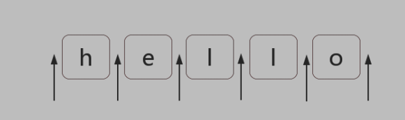

### 位置

###### 什么是位置（锚）



##### 如何匹配位置

- ES5的6个锚符号
  - ^  匹配开头，多行匹配行开头
  - $ 匹配结尾，多行匹配行结尾
  - \b 单词边界 \W和\w之间的位置
  - \B  \b之外的位置
  - (?=p)  p 前面的位置   positive lookahead
  - (?!p) p前面的位置之外的位置  negative lookahead


- ES6新增
  - (?<=p)
  - (?<!p) 

##### 实例

- 不匹配任何字符：`/.^/`

- 数字千分位分隔符：12345678 =>12,345,678 

  - 匹配最后一个逗号

    ```js
    var string = '12345678';
    var regex;
    regex = /?=\d{3}$/;
    console.log(string.replace(regex,',')); // 12345,678
    ```

  - 匹配出所有的逗号

    ```js
    var string = '12345678';
    var regex;
    regex = /?=(\d{3})+$/g;
    console.log(string.replace(regex,',')); // 12,345,678
    ```

  - 解决如果数字个数是3的倍数，则会导致最开始位置有也会被匹配到

    ```js
    var string = '123456789';
    var regex;
    regex = /(?!^)?=(\d{3})+$/g;
    console.log(string.replace(regex,',')); // 123,456,789
    ```

  - 支持一个字符串里面的多个组成修改

    ```js
    var string = "12345678 123456789",
        regex = /(?!\b)(?=(\d{3})+\b)/g; //   /\B(?=(\d{3})+\b)/g
    var result = string.replace(regex, ',')
    console.log(result); // => "12,345,678 123,456,789"
    ```

  - 实现数字货币化

    ```js
    function format (num) { 
    	return num.toFixed(2).replace(/\B(?=(\d{3})+\b)/g, ",").replace(/^/, "$$ "); 
    }; 
    console.log( format(1888) ); // => "$ 1,888.00"
    ```

- 验证密码问题（密码长度 6-12 位，由数字、小写字符和大写字母组成，但必须至少包括 2 种字符）

- - 简化，不考虑“至少包括2种字符”

    ```js
    var regex = /^[0-9A-Za-z]{6,12}$/
    ```

  - 如果必须有数字，则可以有正则`/?=.*[0-9]/`  所以如果【密码必须包含数字且6-12位】

    ```js
    var regex = /?=.*[0-9]^[0-9A-Za-z]{6,12}$/
    ```

  - 同时包含两个字符 比如包含数字或者小写字母  `/(?=.*[0-9])(?=.*[a-z])/`   综合正则

    ```js
    var regex = /(?=.*[0-9])(?=.*[a-z])^[0-9A-Za-z]{6,12}$/
    ```

  - 解析原题 分解成如下情况
    - 同时包含数字和小写字母
    - 同时包含数字和大写字母
    - 同时包含小写字母和大写字母
    - 同时包含数字、小写字母和大写字母

  - 最终正则

    ```js
    var regex = /(?=.*[0-9])(?=.*[a-z])|(?=.*[A-Z])(?=.*[0-9])|(?=.*[a-z])(?=.*[A-Z]))^[0-9a-zA-Z]{6,12}$/
    ```

  - 第二种解法：理解为不能全部都是数字、小写字母、大写字母：不能全为数字则有正则`/(?!^[0-9]{6-12}$)^[0-9a-zA-Z]{6,12}$/`   固有另一种解法

    ```js
    var regex = /(?!^[0-9]{6,12}$)(?!^[a-z]{6,12}$)(?!^[A-Z]{6,12}$)^[0-9A-Za-z]{6,12}$/;
    ```

    